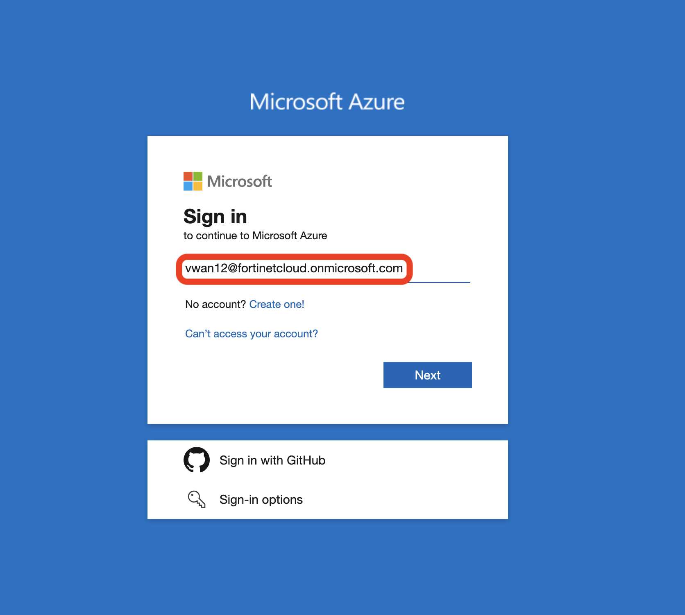
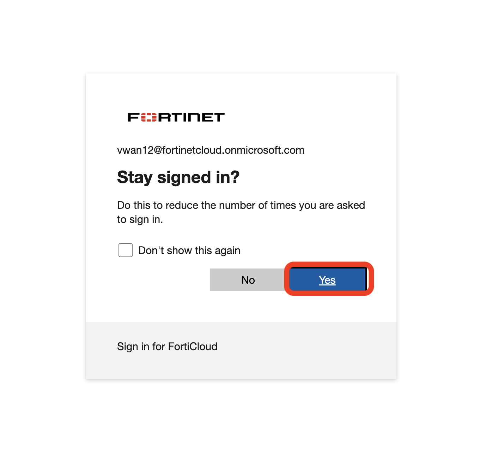
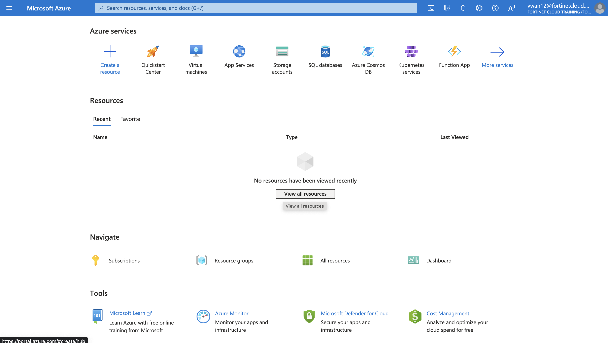
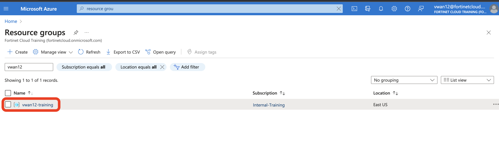

## Login to Portal

1. Navigate to [Azure portal ](https://portal.azure.com "Azure Portal") and login with credentials provided to you. 



2. After entering the credentials, you can say yes for keep signed in. 



3. After logging in you should see that you have access to subscription 



4. In the search bar, type ```resource group``` , click on the resource group service. 


5. You will see your resource group named vwanXX-training. XX is the lab number allocated to you.



6. Click on the resource group to see the resources already deployed. 

Tbefore you move on to the next task, please read below: 

1. Part of environment is already built for you.
2. Please make sure to check all the resources are deployed.

    1. Virtual WAN
    2. Virtual VWAN Hub in East US
    3. Spoke VNETS - Hub1Spoke1 VNET and Hub1Spoke2 VNET
    4. Linux VM's in each of the spokes
    5. Branch FortiGates
    6. Branch VNETS
    7. Branch Linux VM
    8. Storage accounts for console access for each of the Virtual machines

