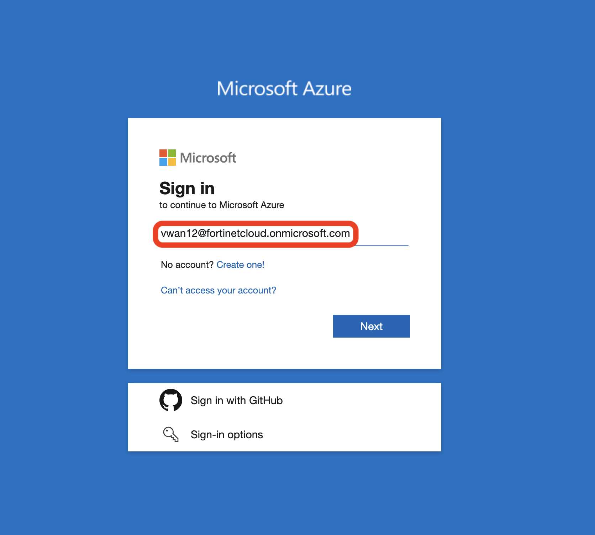
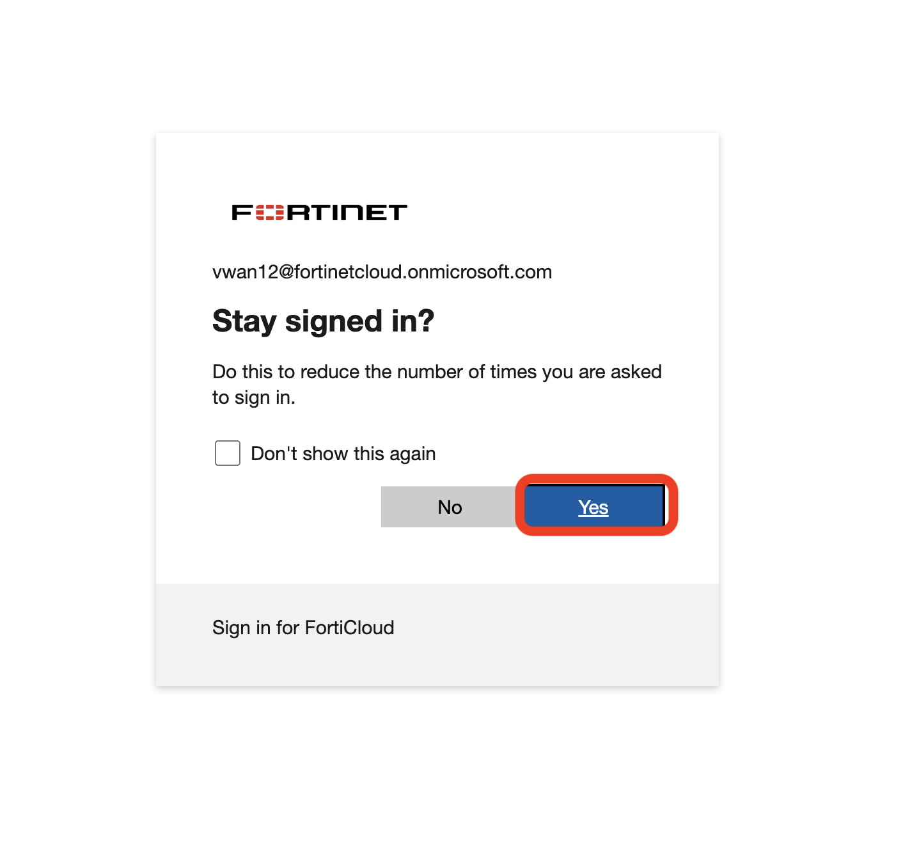
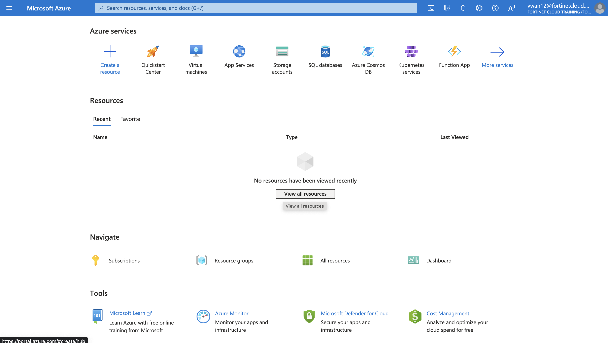
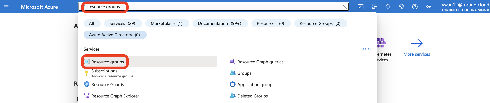
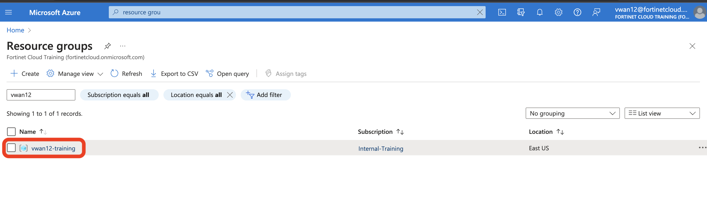

## Login to Portal

1. Navigate to [Azure portal ](https://portal.azure.com "Azure Portal") and login with credentials provided to you. 



2. After entering the credentials, you can say yes for keep signed in. 



3. After logging in you should see that you have access to subscription 



4. In the search bar, type ```resource group``` , click on the resource group service. 



5. You will see your resource group named vwanXX-training. XX is the lab number allocated to you.



6. Click on the resource group to see the resources already deployed. Before you move on to the next task, please read below: 

    a. Your assigned resource group has already been deployed with key resources that will help with this lab and save time. 
    
    b. Please review and make sure all the following resources are deployed in your resource group.

    a. vwanXX-EastUS_VWAN                                                      (QTY 1)
    b. vHub1-EastUS_VHUB                                                       (QTY 1)
    c. Spoke1-vHub1_VNET and Spoke2-vHub1_VNET                                 (QTY 2)
    d. Linux-Spoke1-VM, Linux-Spoke2-VM                                        (QTY 2)
    e. FortiGate-Branch-VM                                                     (QTY 1)
    f. Branch_VNET                                                             (QTY 1)
    g. Linux-Branch-VM                                                         (QTY 1)
    h. Storage accounts for console access for each of the Virtual machines    (QTY 3)

